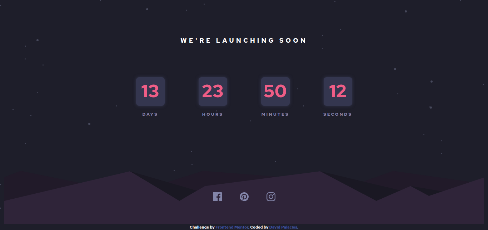

# Frontend Mentor - Launch countdown timer solution

This is a solution to the [Launch countdown timer challenge on Frontend Mentor](https://www.frontendmentor.io/challenges/launch-countdown-timer-N0XkGfyz-). Frontend Mentor challenges help you improve your coding skills by building realistic projects. 

## Table of contents

- [Overview](#overview)
  - [The challenge](#the-challenge)
  - [Screenshot](#screenshot)
  - [Links](#links)
- [My process](#my-process)
  - [Built with](#built-with)
- [Author](#author)

## Overview

### The challenge

Users should be able to:

- See hover states for all interactive elements on the page
- See a live countdown timer that ticks down every second (start the count at 14 days)

### Screenshot

### Links

- Solution URL: [Frontend Mentor](https://www.frontendmentor.io/solutions/countdown-timer-built-with-html-css-jquery-and-bootstrap-hQ2MSO5nw)
- Live Site URL: [GitHub Pages](https://davidpalaciosg.github.io/launch-countdown-timer/)

## My process

### Built with

- Semantic HTML5 markup
- CSS custom properties
- Flexbox
- CSS Grid
- Mobile-first workflow
- [Bootstrap 4](https://getbootstrap.com/) - JS library

## Author

- Website - [David Palacios G](https://davidpalaciosg.com/)
- Frontend Mentor - [@davidpalaciosg](https://www.frontendmentor.io/profile/davidpalaciosg)
- Instagram - [@srpalaciosg](https://www.instagram.com/srpalaciosg/)
